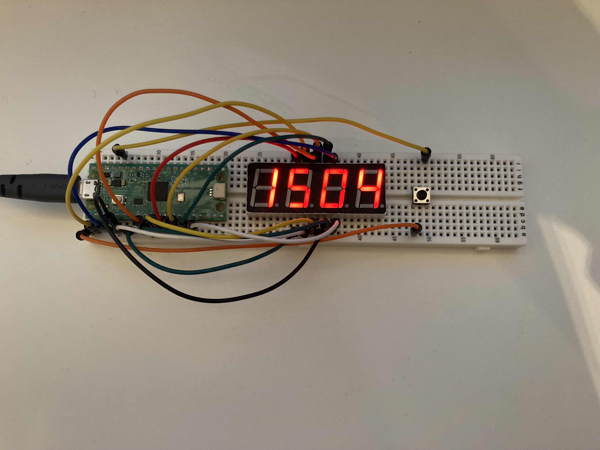
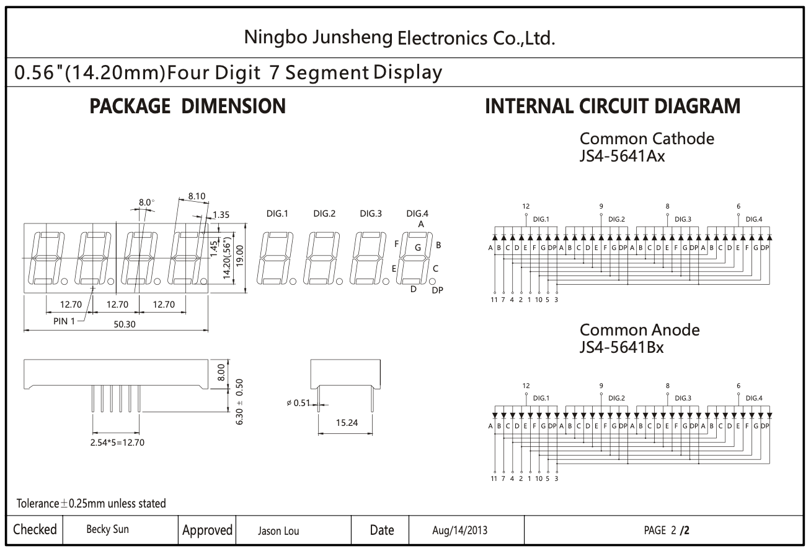
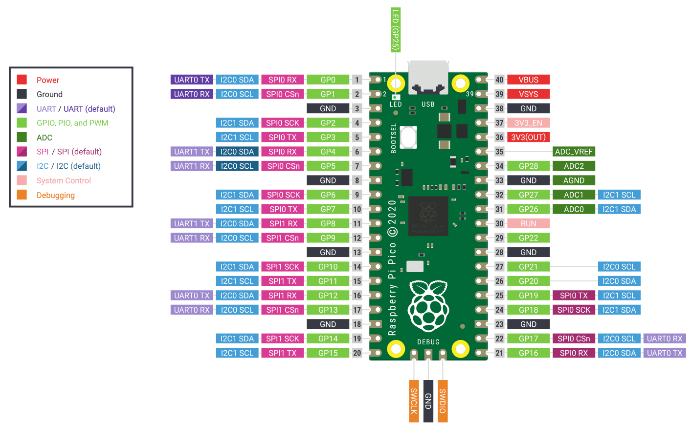

# 7 Segement Clock with the Pi Pico

This project is using a 4 Digit 7 Segment display and a Raspberry Pi pico to create a clock.

# Partlist

|           Part            |
|:-------------------------:|
|     Raspberry Pi Pico     |
| 4 Digit 7 Segment Display |
|      Generic Button       |
|        Breadboard         |

# Datasheets

The 7 Segment Display I used to build this project and in Fritzing are not the same, I would advise you to use the Datasheet of your
7 Segment Display with the GPIO Layout.

## GPIO Layout
|      GPIO       | Corresponding Function |
|:---------------:|:----------------------:|
| FIRST_GPIO - 1  |      Button input      |
| FIRST_GPIO + 0  |           A            |
| FIRST_GPIO + 1  |           B            |
| FIRST_GPIO + 2  |           C            |
| FIRST_GPIO + 3  |           D            |
| FIRST_GPIO + 4  |           E            |
| FIRST_GPIO + 5  |           F            |
| FIRST_GPIO + 6  |           G            |
| FIRST_GPIO + 7  |           DP           |
| FIRST_GPIO + 8  |        Digit 0         |
| FIRST_GPIO + 9  |        Digit 1         |
| FIRST_GPIO + 10 |        Digit 2         |
| FIRST_GPIO + 11 |        Digit 3         |

## Datasheet of 7 Segment Display

## Raspberry Pi Pico Pinout

## Schematic

